# WAI (WHY AM I)

> 나를 들여다보는 식단 관리 앱

**"다이어트가 실패하는 이유는 정말 의지가 부족해서일까요?"**

기존 식단 관리 앱들은 "무엇을 먹어야 하는지"에만 집중할 뿐, **"왜 먹게 되는지"**, "어떤 상황에서 폭식이 발생하는지"와 같은 근본적인 질문은 다루지 않았습니다.  
WAI는 사용자의 식단뿐만 아니라 **"먹는 이유"를 기록하고 이해하는 것**에서 출발한 서비스입니다.

---

## 📱 기획 배경

많은 사람들은 다이어트를 반복적으로 실패합니다.  
하지만 그 원인은 단순한 의지 문제가 아니라, **감정과 행동이 연결된 구조**에 있습니다.

사람은 스트레스를 받으면 폭식을 하게 되고, 폭식 이후에는 죄책감을 느끼며, 그 감정이 다시 우울로 이어지는 **악순환**을 반복하게 됩니다.  
실제로 식이장애 관련 진료 건수는 2018년부터 2022년까지 꾸준히 증가해 왔습니다. *(출처: 국민건강보험공단)*

---

## 🎯 개발 목표

1. **감정 & 식단 연결** — 유저가 자신의 감정과 식사의 연결고리를 스스로 발견할 수 있도록 합니다.
2. **재진입 장벽 완화** — 기록이 끊기면 다시 시작하기 어려운 기존 식단 앱의 한계를 보완해, 실패해도 다시 돌아올 수 있는 낮은 재진입 장벽을 만듭니다.
3. **패턴 기반 맞춤 제안** — 감정과 상황 기록을 바탕으로 유저의 반복 패턴을 분석하고, 오늘의 상태에 맞는 식단을 추천해 자연스러운 행동 변화를 유도합니다.

---

## 🔄 서비스 플로우

```
온보딩 화면 → 패턴 테스트 → 메인 화면 → 오늘 망했어요 플로우 → 주간 리포트
```

---

## 🛠 기술 스택

| 항목 | 내용 | 설명 |
|------|------|------|
| **Framework** | React Native (Expo Web) | React Native 코드를 웹 브라우저에서 실행 — 모바일 화면 비율 기준으로 개발 |
| **Navigation** | React Navigation Native Stack | 화면 전환 및 스택 기반 네비게이션 관리 |
| **State Management** | Context API + AsyncStorage | 전역 상태 관리 및 데이터 영구 저장 (웹에서는 localStorage 기반) |
| **External API** | 전국통합식품영양성분정보표준데이터 API | 실제 음식의 칼로리 · 영양성분 자동 반영 |

---

## 📂 프로젝트 구조

```
wai/
├── App.js                    # 네비게이션 스택 및 전역 Provider 설정
├── context/
│   └── UserContext.js        # 전역 상태 관리 (Context API + AsyncStorage)
└── screen/
    ├── SplashScreen.js       # 스플래시 화면
    ├── onboarding/
    │   ├── Step1.js          # 기본 정보 입력 (이름 · 생년월일 · 성별 · 키 · 체중)
    │   ├── Step2.js          # 목표 설정 (체중 관리 / 감정 + 체중 관리)
    │   ├── Step3.js          # 목표 체중 + 기간 설정 + 기초대사량 계산
    │   ├── Step4.js          # 활동량 선택 → TDEE 기반 목표 칼로리 계산
    │   └── Step5.js          # 나의 식단 카드 생성
    └── main/
        ├── MainScreen.js     # 메인 화면 (감정 기록 · 식단 추천 · 칼로리 현황)
        ├── FoodSearch.js     # 공공 API 식단 검색 및 기록
        ├── PatternIntro.js   # 패턴 테스트 인트로 화면
        ├── PatternTest.js    # 식습관 패턴 테스트 (10문항 · 5점 척도)
        ├── PatternResult.js  # 패턴 유형 결과 화면
        ├── TodayFailed.js    # 오늘 망했어요 플로우 (재진입 루트)
        └── ReportScreen.js   # 주간 리포트 (감정 달력 · 패턴 인사이트 · 탄단지 차트)
```

---

## 🚀 시작하기

```bash
# 패키지 설치
npm install

# 웹에서 실행
npx expo start --web
```

실행하면 브라우저에서 앱이 열립니다.  
모바일 화면 기준으로 개발되었기 때문에, 브라우저 개발자 도구(F12)의 **기기 툴바(모바일 뷰)** 로 보는 것을 권장합니다.

---

## ✨ 주요 기능

### 1. 온보딩 (5단계)
스플래시 화면 이후 기본 정보 입력으로 이어집니다.

- 기본 정보 입력 (이름 · 생년월일 · 성별 · 키 · 체중)
- 목표 설정 — WAI의 취지에 맞게 **감정 + 체중 관리** 항목을 선택할 수 있습니다.
- 목표 체중 + 기간 설정
- 활동량 선택 — 초기 4단계에서 5단계로 확장하며 추가된 단계로, TDEE 기반 목표 칼로리 계산의 정확도를 높였습니다.
- 유저의 활동 패턴에 맞는 **나의 식단 카드** 생성

| Start. 스플래시 | Step1. 기본 정보 입력 | Step2. 목표 설정 |
|:---:|:---:|:---:|
| 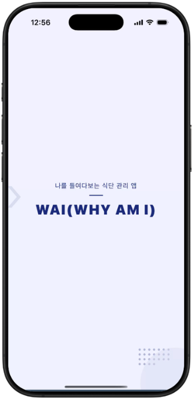 | 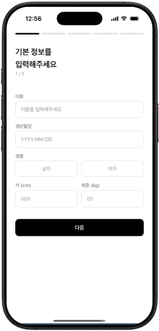 | 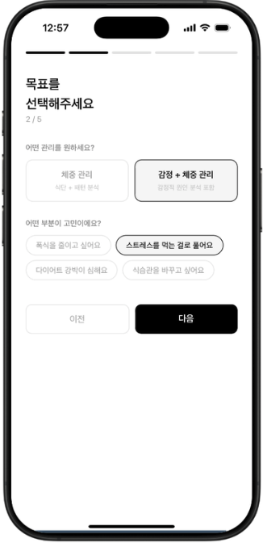 |
 
| Step3. 목표 체중 + 기간 | Step4. 활동량 선택 | Step5. 카드 생성 |
|:---:|:---:|:---:|
| 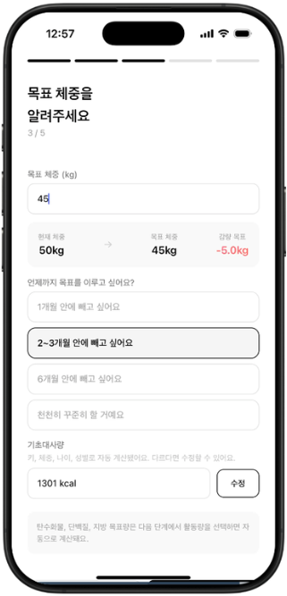 | 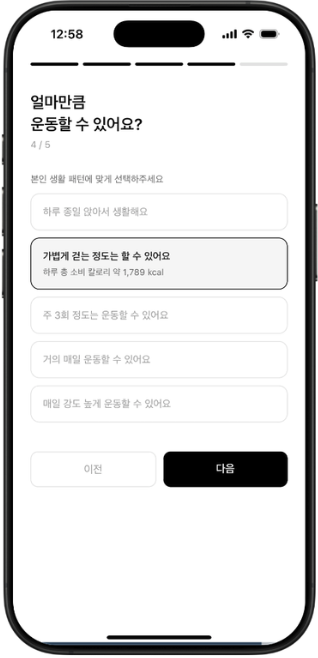 | 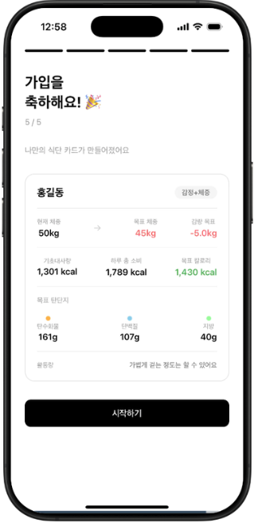 |

### 2. 패턴 테스트 (10문항)
온보딩이 끝나면 메인 화면에서 *"이전에 다이어트를 해본 적이 있어요?"* 라는 질문창이 뜨고, "있어요"를 선택하면 패턴 테스트로 이어집니다.

- 질문은 **감정 및 스트레스 / 숨겨진 행동 패턴 / 심리와 죄책감**의 세 가지 축으로 구성했습니다.
- 5점 척도로 답변하면 4가지 섭식 유형 중 유저에게 가장 가까운 유형의 카드가 제시됩니다.

| 유형 | 특징 |
|------|------|
| 감정적 섭식 | 기분에 따라 식욕이 크게 달라지고, 감정 해소를 위해 음식을 찾는 경향 |
| 무의식적 섭식 | 자신도 모르게 습관적으로 먹는 경향 |
| 악순환 섭식 | 폭식 → 죄책감 → 폭식이 반복되는 경향 |
| 균형 섭식 | 세 축 모두 기준 미달인 비교적 안정적인 식습관 |

| 1. 팝업창 | 2. 테스트 인트로 | 3. 패턴 테스트 | 4. 결과 카드 |
|:---:|:---:|:---:|:---:|
| 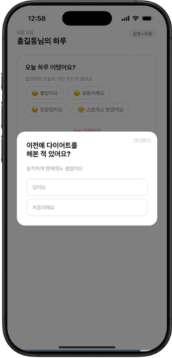 | 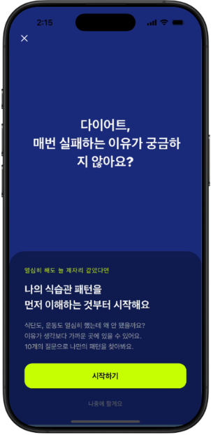 | 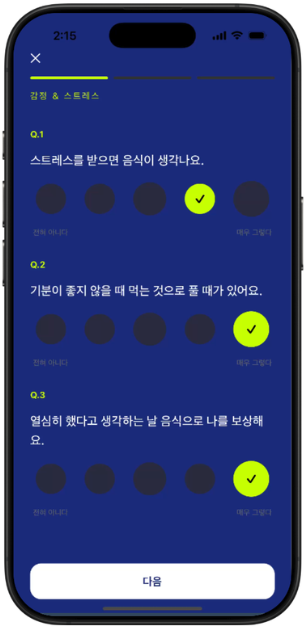 | 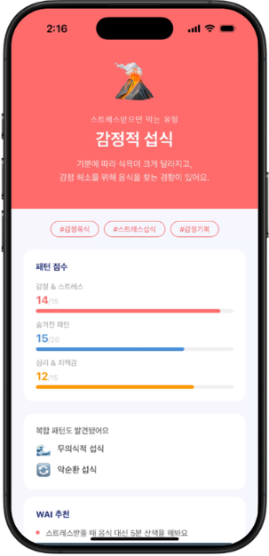 |

### 3. 메인 화면
WAI의 핵심인 **감정 기록**을 가장 먼저 보여줍니다.

- 서술형 입력도 고려했지만, 장기적으로 유저에게 부담이 될 수 있다고 판단해 **감정 선택지를 4개**로 줄였습니다.
- 감정을 선택하면 그에 맞는 식사 팁과 추천 식단이 바로 제공됩니다.
- 먹은 음식은 검색을 통해 기록할 수 있으며, 예를 들어 그릭요거트를 검색하면 공공 API의 실제 영양성분이 화면에 반영됩니다.

| 1. 감정 기록 | 2. 식단 추천 | 3. 식단 기록 | 4. 반영 + 식단 추천 |
|:---:|:---:|:---:|:---:|
| 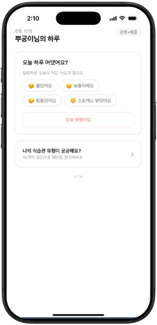 | 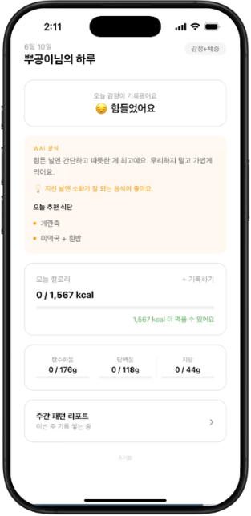 | 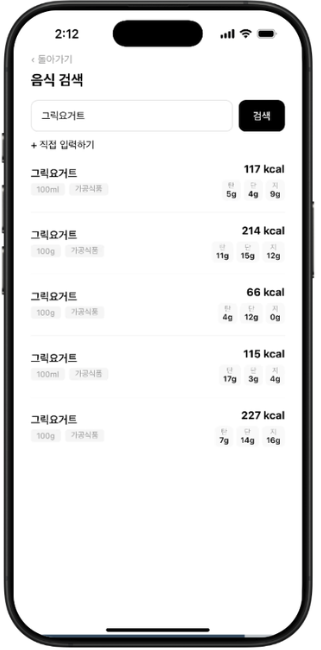 | 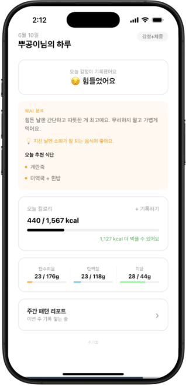 |

### 4. 오늘 망했어요 플로우
식단을 지키지 못한 날에도 다시 시작할 수 있도록 만든 **재진입 루트**입니다.

```
공감 & 원인 파악 → 상황 파악 → 추가 질문 (수면 · 시간대 · 관계) → 즉각 인사이트 + 시작점 재설정 → Tip & 식단 추천
```

단순히 실패로 끝나는 것이 아니라, 실패가 이탈로 이어지지 않도록 유저가 다시 앱으로 돌아올 수 있는 연결점을 만들어줍니다.  
기존 식단 앱들이 장기적으로 유저를 붙잡기 어려운 점을 고려해, **실패한 날도 하나의 데이터가 되어 자연스럽게 다음 시작점**이 될 수 있도록 설계했습니다.

| 1. 공감 & 원인 | 2. 상황 파악 | 3. 추가 질문 | 4. 인사이트 + 재설정 | 5. Tip & 식단 추천 |
|:---:|:---:|:---:|:---:|:---:|
| 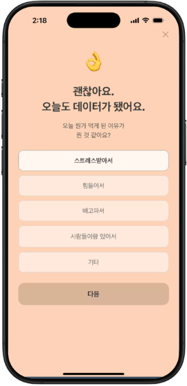 | 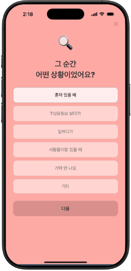 | 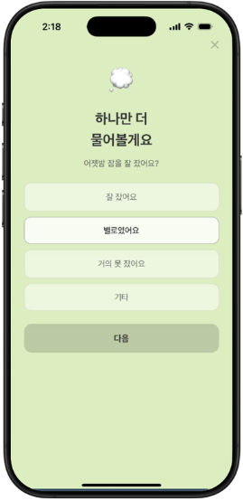 | 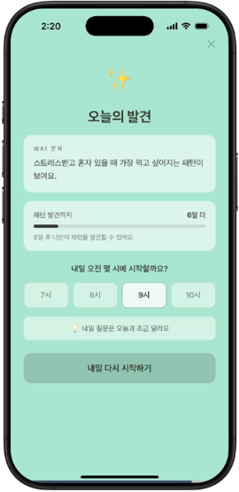 | 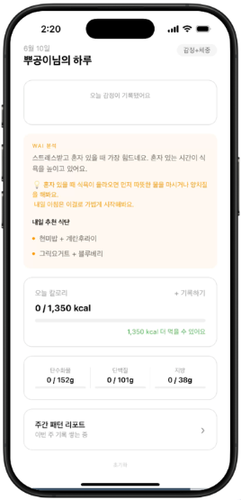 |

### 5. 주간 리포트
- **감정 달력**을 통해 하루의 감정 흐름을 확인하고, 이를 식단 패턴과 연결해볼 수 있습니다.
- 주간 **탄단지 패턴과 초과 항목**을 함께 제시해, 유저가 자신의 식습관을 더 명확하게 돌아볼 수 있도록 했습니다.

| 리포트 진입 | 감정 달력 · 패턴 발견 | 탄단지 그래프 |
|:---:|:---:|:---:|
| 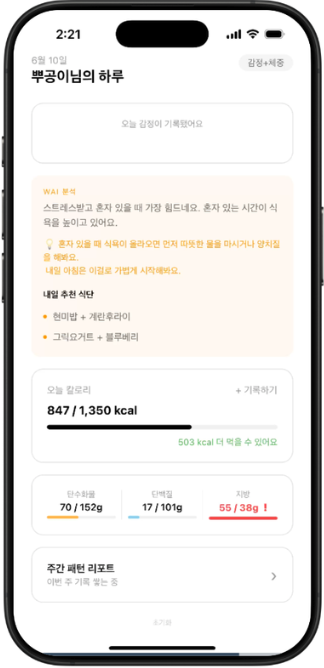 | 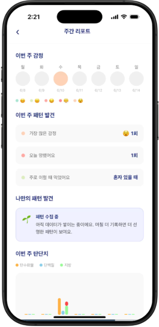 | 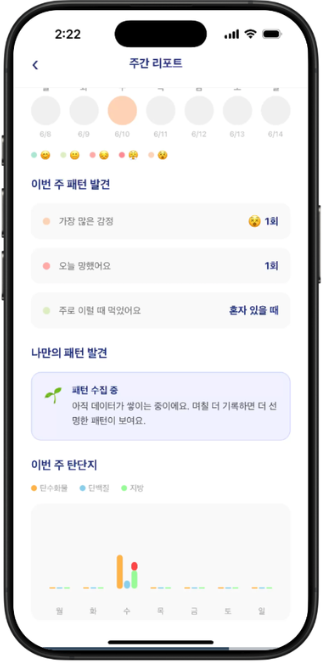 |

---

## 📊 구현에 활용된 계산

### 기초대사량 — 해리스-베네딕트 공식
```
여자: 655 + (9.6 × 체중) + (1.8 × 키) - (4.7 × 나이)
```

### 하루 총 소비 칼로리 (TDEE) — ACSM 활동 계수
```
TDEE = 기초대사량 × 활동 계수
```
| 활동량 | 계수 |
|--------|------|
| 거의 안 움직임 | × 1.2 |
| 가볍게 걷는 정도 | × 1.375 |
| 주 3회 운동 | × 1.55 |
| 거의 매일 운동 | × 1.725 |
| 매일 고강도 | × 1.9 |

### 목표 칼로리 (삼성서울병원 기준 활용)
```
Step1. 목표 감량 칼로리 = 감량할 체중(kg) × 7,000kcal
Step2. 일일 적자 = Step1 결과 ÷ 기간(일)
Step3. 목표 칼로리 = TDEE − 적자
```

### 탄/단/지 비율
| 목표 유형 | 탄수화물 | 단백질 | 지방 |
|-----------|----------|--------|------|
| 체중 관리 | 40% | 30% | 30% |
| 감정 + 체중 | 45% | 30% | 25% |

감정 + 체중 관리를 선택한 경우 탄수화물 비율을 약간 높여, 유저가 심리적으로 부담 없이 지킬 수 있도록 조정했습니다.

### 패턴 점수 계산
| 축 | 문항 | 판정 기준 |
|------|------|-----------|
| 감정 & 스트레스 | Q1~Q3 (최대 15점) | 9점 이상 (60%) → 감정적 섭식 유형 |
| 숨겨진 행동 패턴 | Q4~Q7 (최대 20점) | 12점 이상 (60%) → 무의식적 섭식 유형 |
| 심리 & 죄책감 | Q8~Q10 (최대 15점) | 9점 이상 (60%) → 악순환 섭식 유형 |
| 균형 | Q1~Q10 (최대 50점) | 전 축 60% 미달 → 균형 섭식 유형 |

---

## 💥 임팩트

WAI는 단순히 식단을 기록하는 앱이 아니라, 유저가 자신의 감정과 식사 패턴의 연결고리를 찾을 수 있도록 돕는 서비스입니다.

- **감정 데이터 기반 사용자 맞춤** — 감정과 상황을 함께 기록하는 과정에서 개인별 폭식 트리거를 파악하고, 폭식 상황에 사전 대비할 수 있습니다.
- **재진입 장벽 최소화** — 포기한 날도 데이터로 저장되고 시작점을 재설정할 수 있어, 실패가 끝이 아닌 새로운 시작점이 됩니다. → 장기적인 유저 유치 가능성 ↑
- **즉각 피드백 설계** — 답변 즉시 인사이트를 제공하므로 결과를 보기 위해 며칠씩 기다릴 필요가 없습니다.
- **낮은 기록 부담** — 대부분의 선택지를 버튼형으로 구성해 서술형 입력보다 훨씬 부담 없이 사용할 수 있습니다.

---

## 📌 한계점 & 개선 방향

| 한계점 | 개선 방향 |
|--------|-----------|
| **수동 기록 의존성** — 식단과 감정 모두 유저가 직접 입력해야 하며, 기록하지 않으면 데이터가 쌓이지 않음 | 푸시 알림 · 식사 시간대 설정을 통한 자동 기록 유도 |
| **추천 식단의 한계** — 감정별 고정된 추천 식단으로, 유저의 알레르기 · 세부 선호도 미반영 | 매일 감정 질문과 함께 "오늘 뭐가 땡겨요"를 선택 → 그날의 식욕 유형을 반영한 유동적인 추천 |
| **패턴 발견까지 긴 시간 소요** — 같은 감정 + 상황 조합이 2번 이상 나와야 인사이트가 뜨는 구조 | AI를 활용해 데이터가 적어도 패턴 테스트 결과 + 감정 기록을 조합한 즉각적인 인사이트 제공 |

---

## 📚 참고 자료

- 국민건강보험공단, 식이장애 관련 진료 건수 (2018–2022)
- Harris-Benedict 공식 (기초대사량)
- ACSM 활동 계수 (TDEE)
- 삼성서울병원 목표 칼로리 산정 기준

---

## 발표 자료

- 📎 [프로젝트 발표 자료 (PDF)](./docs/WAI_발표자료.pdf)

---